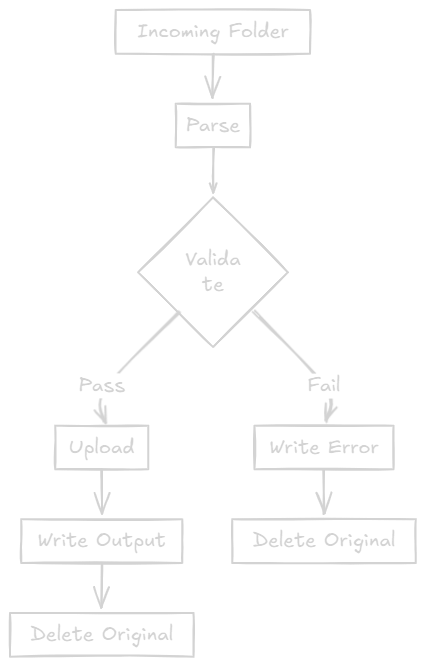

# TransTrack Legacy Document Intake & Validation System

## Table of Contents

- [Project Overview](#project-overview)
- [System Architecture](#system-architecture)
- [Prerequisites](#prerequisites)
- [Setup Instructions](#setup-instructions)
- [Cloudinary Configuration](#cloudinary-configuration)
- [Running the Processors](#running-the-processors)
- [Testing](#testing)
- [Project Structure](#project-structure)
- [Validation Rules](#validation-rules)
- [Troubleshooting](#troubleshooting)

---

## Project Overview

TransTrack Ltd. operates two warehouses (North and South) that generate daily shipment files. This system processes, validates, and uploads these files to the cloud while maintaining proper audit trails.

**Key Features:**

- Two independent console applications (NorthProcessor & SouthProcessor)
- Shared reusable DLL components
- Config-driven folder paths and credentials
- Warehouse-specific validation rules
- Cloudinary cloud storage integration
- Comprehensive logging system
- Full unit and integration test coverage

## System Architecture

### High-Level Architecture

```text
┌─────────────────────────────────────────────────────────────┐
│                    TransTrack System                        │
├─────────────────────────────────────────────────────────────┤
│                                                             │
│  ┌──────────────────┐         ┌──────────────────┐        │
│  │ NorthProcessor   │         │ SouthProcessor   │        │
│  │    (.exe)        │         │    (.exe)        │        │
│  │                  │         │                  │        │
│  │ • CSV Parser     │         │ • TXT Parser     │        │
│  │ • NorthValidator │         │ • SouthValidator │        │
│  │ • Cloudinary     │         │ • Cloudinary     │        │
│  └────────┬─────────┘         └────────┬─────────┘        │
│           │                            │                   │
│           └────────────┬───────────────┘                   │
│                        │                                   │
│           ┌────────────▼───────────────┐                   │
│           │   Shared DLL Components    │                   │
│           ├────────────────────────────┤                   │
│           │ • TransTrack.Common.Models │                   │
│           │ • TransTrack.FileHandling  │                   │
│           │ • TransTrack.Logging       │                   │
│           └────────────┬───────────────┘                   │
│                        │                                   │
│           ┌────────────▼───────────────┐                   │
│           │   External Services        │                   │
│           ├────────────────────────────┤                   │
│           │ • Cloudinary API           │                   │
│           │ • File System              │                   │
│           └────────────────────────────┘                   │
│                                                             │
└─────────────────────────────────────────────────────────────┘
```

### Component Breakdown

**Console Applications:**

1. **NorthProcessor.exe** - Processes CSV files from Warehouse North
2. **SouthProcessor.exe** - Processes TXT files from Warehouse South

**Shared DLLs:**

1. **TransTrack.Common.Models.dll** - POCO classes (ShipmentRecord, ValidationResult, ProcessingSummary)
2. **TransTrack.FileHandling.dll** - File operations (parsers, writers, file operations)
3. **TransTrack.Logging.dll** - Logging interface and implementation

**External Dependencies:**

- **CloudinaryDotNet** - Cloud file upload service
- **.NET Framework 4.8** - Runtime environment

### Data Flow



---

## Prerequisites

### Required Software

1. **Visual Studio 2019/2022** (Community Edition or higher)
   - Workload: .NET desktop development
2. **.NET Framework 4.8 Developer Pack**

   - Download: <https://dotnet.microsoft.com/download/dotnet-framework/net48>

3. **Cloudinary Account** (Free Tier)
   - Sign up: <https://cloudinary.com/users/register/free>

## Setup Instructions

### 1. Clone/Download the Project

```bash
git clone <repository-url>
cd TransTrack
```

### 2. Create Folder Structure

Run the following commands in **Command Prompt (Administrator)**:

```batch
mkdir C:\TransTrack
mkdir C:\TransTrack\Logs
mkdir C:\TransTrack\Warehouses\North\Incoming
mkdir C:\TransTrack\Warehouses\North\Processed
mkdir C:\TransTrack\Warehouses\North\Errors
mkdir C:\TransTrack\Warehouses\South\Incoming
mkdir C:\TransTrack\Warehouses\South\Processed
mkdir C:\TransTrack\Warehouses\South\Errors
```

**Final Structure:**

```
C:\TransTrack\
├── Logs\
│   └── system.log (auto-created)
└── Warehouses\
    ├── North\
    │   ├── Incoming\
    │   ├── Processed\
    │   └── Errors\
    └── South\
        ├── Incoming\
        ├── Processed\
        └── Errors\
```

### 3. Open Solution in Visual Studio

1. Open `TransTrack.sln`
2. Wait for NuGet package restore to complete
3. Build the solution: **Build → Rebuild Solution** (Ctrl+Shift+B)

### 4. Verify Build

Check that all projects build successfully:

- ✅ TransTrack.Common.Models
- ✅ TransTrack.Logging
- ✅ TransTrack.FileHandling
- ✅ NorthProcessor
- ✅ SouthProcessor
- ✅ TransTrack.Tests

## Cloudinary Configuration

### 1. Get Your Credentials

1. Log in to [Cloudinary Dashboard](https://cloudinary.com/console)
2. Navigate to **Dashboard** (default landing page)
3. Find your credentials in the **Account Details** section:
   - **Cloud Name**: `dxxxxxxxx`
   - **API Key**: `123456789012345`
   - **API Secret**: `abcdefghijklmnopqrstuvwxyz123456`

### 2. Configure NorthProcessor

Edit `NorthProcessor/App.config`:

```xml
<?xml version="1.0" encoding="utf-8" ?>
<configuration>
  <appSettings>
    <add key="IncomingFolder" value="C:\TransTrack\Warehouses\North\Incoming"/>
    <add key="ProcessedFolder" value="C:\TransTrack\Warehouses\North\Processed"/>
    <add key="ErrorsFolder" value="C:\TransTrack\Warehouses\North\Errors"/>
    <add key="LogFilePath" value="C:\TransTrack\Logs\system.log"/>

    <!-- REPLACE THESE WITH YOUR CLOUDINARY CREDENTIALS -->
    <add key="CloudinaryCloudName" value="YOUR_CLOUD_NAME"/>
    <add key="CloudinaryApiKey" value="YOUR_API_KEY"/>
    <add key="CloudinaryApiSecret" value="YOUR_API_SECRET"/>
  </appSettings>
</configuration>
```

### 3. Configure SouthProcessor

Edit `SouthProcessor/App.config` with the **same Cloudinary credentials**:

```xml
<?xml version="1.0" encoding="utf-8" ?>
<configuration>
  <appSettings>
    <add key="IncomingFolder" value="C:\TransTrack\Warehouses\South\Incoming"/>
    <add key="ProcessedFolder" value="C:\TransTrack\Warehouses\South\Processed"/>
    <add key="ErrorsFolder" value="C:\TransTrack\Warehouses\South\Errors"/>
    <add key="LogFilePath" value="C:\TransTrack\Logs\system.log"/>

    <!-- REPLACE THESE WITH YOUR CLOUDINARY CREDENTIALS -->
    <add key="CloudinaryCloudName" value="YOUR_CLOUD_NAME"/>
    <add key="CloudinaryApiKey" value="YOUR_API_KEY"/>
    <add key="CloudinaryApiSecret" value="YOUR_API_SECRET"/>
  </appSettings>
</configuration>
```

### 4. Rebuild After Configuration

After updating credentials:

```text
Build → Rebuild Solution
```

## Running the Processors

### North Processor (CSV Files)

1. **Place CSV file** in: `C:\TransTrack\Warehouses\North\Incoming\`

   Example (`north_shipment.csv`):

   ```csv
   SH1001,Accra,Tema,2024-10-12,150.5
   SH1002,Accra,Kumasi,2024-09-20,90
   ```

2. **Set as Startup Project**:

   - Right-click `NorthProcessor` → **Set as Startup Project**

3. **Run**: Press **F5** or click **Start**

4. **Check Results**:
   - Valid: `C:\TransTrack\Warehouses\North\Processed\north_shipment_processed.csv`
   - Invalid: `C:\TransTrack\Warehouses\North\Errors\north_shipment_error.csv`
   - Log: `C:\TransTrack\Logs\system.log`

### South Processor (TXT Files)

1. **Place TXT file** in: `C:\TransTrack\Warehouses\South\Incoming\`

   Example (`south_shipment.txt`):

   ```txt
   S-55221|North|Takoradi|2024-11-13|Bulk
   S-55222|East|Tema|2024-11-11|Fragile
   ```

2. **Set as Startup Project**:

   - Right-click `SouthProcessor` → **Set as Startup Project**

3. **Run**: Press **F5** or click **Start**

4. **Check Results**:
   - Valid: `C:\TransTrack\Warehouses\South\Processed\south_shipment_processed.txt`
   - Invalid: `C:\TransTrack\Warehouses\South\Errors\south_shipment_error.txt`
   - Log: `C:\TransTrack\Logs\system.log`

## Testing

### Run All Tests

#### Option 1: Test Explorer

1. **Test → Test Explorer**
2. Click **Run All** (green play button)

#### Option 2: Keyboard Shortcut

```text
Ctrl + R, A
```

### Test Coverage

**Unit Tests** (27 tests):

- ✅ CsvParserTests (7 tests)
- ✅ TxtParserTests (6 tests)
- ✅ NorthValidatorTests (12 tests)
- ✅ SouthValidatorTests (12 tests)
- ✅ FileLoggerTests (8 tests)

**Integration Tests** (7 tests):

- ✅ End-to-end file processing
- ✅ Output folder verification
- ✅ Error handling verification
- ✅ Multi-file processing
- ✅ Logging integration

### Expected Test Results

All tests should pass (green checkmarks):

```text
Total: 34 tests
Passed: 34
Failed: 0
Skipped: 0
```

---

## Project Structure

```text
TransTrackSystem/
├── NorthProcessor/
│   ├── Program.cs                  # Entry point
│   ├── ProcessorEngine.cs          # Main processing logic
│   ├── NorthValidator.cs           # CSV validation rules
│   ├── CloudinaryUploader.cs       # File upload
│   └── App.config                  # Configuration
│
├── SouthProcessor/
│   ├── Program.cs                  # Entry point
│   ├── ProcessorEngine.cs          # Main processing logic
│   ├── SouthValidator.cs           # TXT validation rules
│   ├── CloudinaryUploader.cs       # File upload
│   └── App.config                  # Configuration
│
├── TransTrack.Common.Models/
│   ├── ShipmentRecord.cs           # Shipment data model
│   ├── ValidationResult.cs         # Validation result
│   └── ProcessingSummary.cs        # Processing summary
│
├── TransTrack.FileHandling/
│   ├── IFileParser.cs              # Parser interface
│   ├── CsvParser.cs                # CSV file parser
│   ├── TxtParser.cs                # TXT file parser
│   ├── FileOperations.cs           # File delete operations
│   └── OutputWriter.cs             # Output file writer
│
├── TransTrack.Logging/
│   ├── ILogger.cs                  # Logger interface
│   └── FileLogger.cs               # File logger implementation
│
└── TransTrack.Tests/
    ├── CsvParserTests.cs
    ├── TxtParserTests.cs
    ├── NorthValidatorTests.cs
    ├── SouthValidatorTests.cs
    ├── FileLoggerTests.cs
    └── IntegrationTests.cs
```

## Validation Rules

### North Warehouse (CSV Files)

| Field           | Rule                                                 |
| --------------- | ---------------------------------------------------- |
| **ShipmentId**  | Not empty, alphanumeric only (no special characters) |
| **Origin**      | Not empty                                            |
| **Destination** | Not empty                                            |
| **Date**        | Valid date format, not in the future                 |
| **Weight**      | Decimal number > 0                                   |

**Format**: `ShipmentId,Origin,Destination,Date,Weight`

**Valid Example**:

```csv
SH1001,Accra,Tema,2024-10-12,150.5
```

**Invalid Examples**:

```csv
SH-1001,Accra,Tema,2024-10-12,150.5    # Invalid: Hyphen in ShipmentId
SH1001,,Tema,2024-10-12,150.5           # Invalid: Empty Origin
SH1001,Accra,Tema,2025-12-31,150.5     # Invalid: Future date
SH1001,Accra,Tema,2024-10-12,0         # Invalid: Zero weight
```

### South Warehouse (TXT Files)

| Field           | Rule                                            |
| --------------- | ----------------------------------------------- |
| **ShipmentId**  | Must start with `S-`                            |
| **Region**      | One of: North, South, East, West                |
| **Destination** | Not empty                                       |
| **Date**        | Valid date, **not a weekend** (Saturday/Sunday) |
| **LoadType**    | One of: Fragile, Bulk, Liquid                   |

**Format**: `ShipmentId|Region|Destination|Date|LoadType`

**Valid Example**:

```txt
S-55221|North|Takoradi|2024-11-13|Bulk
```

**Invalid Examples**:

```txt
55221|North|Takoradi|2024-11-13|Bulk       # Invalid: Missing S- prefix
S-55221|Central|Takoradi|2024-11-13|Bulk   # Invalid: Invalid region
S-55221|North|Takoradi|2024-11-17|Bulk     # Invalid: Weekend (Sunday)
S-55221|North|Takoradi|2024-11-13|Heavy    # Invalid: Invalid LoadType
```

## Troubleshooting

### Common Issues

#### 1. "Cloudinary upload failed"

**Cause**: Invalid credentials or no internet connection

**Solution**:

- Verify credentials in App.config
- Check internet connection
- Ensure Cloudinary account is active

#### 2. "No files found in incoming folder"

**Cause**: Files in wrong folder or wrong extension

**Solution**:

- North: Use `.csv` files in `C:\TransTrack\Warehouses\North\Incoming\`
- South: Use `.txt` files in `C:\TransTrack\Warehouses\South\Incoming\`

#### 3. "Access Denied" errors

**Cause**: Insufficient permissions

**Solution**:

- Run Visual Studio as Administrator
- Check folder permissions on `C:\TransTrack\`

#### 4. "System.Configuration missing"

**Cause**: Missing assembly reference

**Solution**:

1. Right-click project References
2. Add Reference → Assemblies → Framework
3. Check ✓ System.Configuration
4. Rebuild

#### 5. Tests failing

**Cause**: Various reasons

**Solution**:

- Clean Solution: **Build → Clean Solution**
- Rebuild: **Build → Rebuild Solution**
- Check test output for specific errors

### Log File Location

All activities are logged to:

```text
C:\TransTrack\Logs\system.log
```

Check this file for detailed error messages and processing history.

### Getting Help

1. Check log file: `C:\TransTrack\Logs\system.log`
2. Verify folder permissions
3. Ensure all prerequisites are installed
4. Review validation rules for your file format

## Sample Files

### Valid North CSV

```csv
SH1001,Accra,Tema,2024-10-12,150.5
SH1002,Accra,Kumasi,2024-09-20,90
SH1003,Tema,Takoradi,2024-11-01,200.75
```

### Valid South TXT

```txt
S-55221|North|Takoradi|2024-11-13|Bulk
S-55222|East|Tema|2024-11-11|Fragile
S-55223|West|Accra|2024-12-05|Liquid
```
